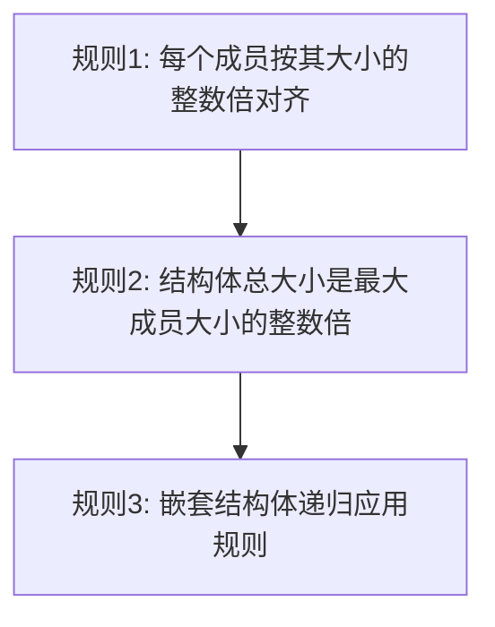

# 第 1 章 - C 语言数据类型与内存布局

<link rel="stylesheet" href="../npu/assets/print-b5.css">

## 📝 本章总结

本章介绍了 C 语言基本数据类型、内存布局、结构体对齐和位域。重点掌握 `sizeof`、`alignof` 和嵌入式开发中的结构体设计陷阱。


---

## 📖 本章内容

1. 基础整数类型与平台差异
2. struct 内存对齐规则
3. union 与类型转换
4. 位域 (Bit Fields)
5. typedef 与命名规范

---

## 1. 基础整数类型与平台差异

### 1.1 为什么不用 `int`、`long`？

C 语言标准只规定了类型的**最小范围**，不同平台大小不同：

| 类型 | 32-bit ARM | 64-bit x86 | 嵌入式 (32-bit MCU) |
|------|-----------|-----------|---------------------|
| `char` | 1 byte | 1 byte | 1 byte |
| `short` | 2 bytes | 2 bytes | 2 bytes |
| `int` | 4 bytes | 4 bytes | 4 bytes |
| `long` | 4 bytes | **8 bytes** | 4 bytes |
| `long long` | 8 bytes | 8 bytes | 8 bytes |
| `pointer` | 4 bytes | 8 bytes | 4 bytes |

**嵌入式开发铁律**：**永远不要依赖 `long` 的大小**。

### 1.2 `<stdint.h>` 固定宽度类型

```c
#include <stdint.h>

uint8_t   status;     // 无符号 8-bit，永远 1 字节
uint16_t  reg_val;    // 无符号 16-bit，永远 2 字节
uint32_t  base_addr;  // 无符号 32-bit，永远 4 字节
int32_t   offset;     // 有符号 32-bit，永远 4 字节
```

**优势**：跨平台一致、寄存器宽度精确匹配、代码可读性强。

---

## 2. struct 内存对齐规则

### 2.1 为什么需要内存对齐？

CPU 读取内存时，**按字对齐访问最快**（如 4 字节对齐）。如果数据结构跨越了对齐边界，CPU 需要分两次读取，甚至触发硬件异常（某些 ARM 平台）。

### 2.2 对齐规则



**示例 1：有 Padding 的结构体**

```c
struct BadLayout {
    char    flag;       // offset 0, size 1
    // 3 bytes padding   ← 为了让 uint32_t 对齐到 4 的倍数
    uint32_t value;     // offset 4, size 4
    uint16_t count;     // offset 8, size 2
    // 2 bytes padding   ← 总大小必须是 4 的倍数 (最大成员是 uint32_t)
};
// sizeof(struct BadLayout) = 12 bytes (实际数据只有 7 bytes!)
```

**示例 2：优化后的结构体**

```c
struct GoodLayout {
    uint32_t value;     // offset 0, size 4
    uint16_t count;     // offset 4, size 2
    char     flag;      // offset 6, size 1
    // 1 byte padding    ← 凑成 8 bytes
};
// sizeof(struct GoodLayout) = 8 bytes (省了 4 bytes!)
```

### 2.3 强制紧凑排列

某些场景需要和硬件协议严格对齐（如 NPU 指令包），可以用 GCC 属性：

```c
struct __attribute__((packed)) NpuCommand {
    uint8_t  opcode;
    uint32_t addr;      // 不会插入 padding，紧挨着 opcode
    uint16_t config;
};
// sizeof = 7 bytes (无 padding)
```

**注意**：`packed` 结构体访问速度更慢，且未对齐访问在某些 ARM 平台会触发 `SIGBUS`。

---

## 3. union 与类型转换

### 3.1 union 的内存共享

```c
union RegValue {
    uint32_t raw;       // 32-bit 原始值
    struct {
        uint8_t  b0;    // bit  0-7
        uint8_t  b1;    // bit  8-15
        uint8_t  b2;    // bit 16-23
        uint8_t  b3;    // bit 24-31
    } bytes;
};

union RegValue v;
v.raw = 0x12345678;
printf("b0=%02x, b3=%02x\n", v.bytes.b0, v.bytes.b3);
// 小端序: b0=78, b3=12
```

**常见用途**：寄存器值的多视角解析、协议报文的不同解读。

---

## 4. 位域 (Bit Fields)

### 4.1 基础语法

```c
struct ConfigReg {
    uint32_t enable   : 1;   // 占 1 bit
    uint32_t mode     : 3;   // 占 3 bits
    uint32_t stride   : 12;  // 占 12 bits
    uint32_t reserved : 16;  // 保留位
};
// 总共 32 bits (4 bytes)
```

### 4.2 位域的坑

```c
struct DangerousBits {
    uint8_t  a : 4;
    uint8_t  b : 4;
};
```

**警告**：位域的**位序 (bit ordering)** 是编译器相关的！GCC 和 Clang 在大小端机器上的表现可能不同。**不推荐用于需要精确硬件映射的场景**，建议用位运算代替。

---

## 5. typedef 与命名规范

### 5.1 结构体 typedef 的两种写法

```c
// 写法 A：需要 struct 关键字
struct Point {
    int32_t x, y;
};
struct Point p;  // 必须带 struct

// 写法 B：typedef 别名 (推荐)
typedef struct {
    int32_t x, y;
} Point_t;
Point_t p;  // 直接使用
```

### 5.2 嵌入式命名惯例

| 后缀 | 含义 | 示例 |
|------|------|------|
| `_t` | 类型 (Type) | `uint32_t`, `Config_t` |
| `_ptr` | 指针 | `buf_ptr` |
| `_len` | 长度 | `data_len` |
| `_flag` | 标志位 | `ready_flag` |
| `_reg` | 寄存器映射 | `NPU_CMD_reg` |

---

**最后更新**: 2026-04-21  
**维护者**: 苏亚雷斯 (Suarez)
