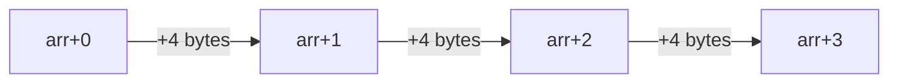

# 第 2 章 - 指针与内存管理

<link rel="stylesheet" href="../npu/assets/print-b5.css">

## 📝 本章总结

本章讲解了指针的本质、指针运算、动态内存分配（malloc/free）、野指针和内存泄漏的预防。


---

## 📖 本章内容

1. 指针的本质：地址 + 类型
2. 指针运算与数组
3. void* 泛型指针
4. 函数指针与回调
5. malloc 的陷阱与替代方案

---

## 1. 指针的本质：地址 + 类型

### 1.1 指针的两个属性

```c
uint32_t value = 0xDEADBEEF;
uint32_t *ptr = &value;

// ptr 有两个属性：
// 1. 地址值：0x7ffd1234 (指向 value 的内存位置)
// 2. 类型：uint32_t* (决定了 *ptr 读取 4 个字节)
```

**解引用时的类型决定读取长度**：

```c
uint32_t val = 0x12345678;
uint8_t  *p8  = (uint8_t*)&val;
uint16_t *p16 = (uint16_t*)&val;

printf("%02x\n", *p8);   // 小端序: 78 (读 1 byte)
printf("%04x\n", *p16);  // 小端序: 5678 (读 2 bytes)
```

### 1.2 NULL 指针

```c
int *ptr = NULL;  // 等价于 (void*)0

// ✅ 正确检查
if (ptr == NULL) { ... }
if (!ptr) { ... }

// ❌ 错误：解引用 NULL 会直接段错误 (SIGSEGV)
int x = *ptr;  // 💥
```

---

## 2. 指针运算与数组

### 2.1 指针算术运算

指针加减时，**按指向的类型大小步进**：

```c
uint32_t arr[5] = {10, 20, 30, 40, 50};
uint32_t *p = arr;  // 等价于 &arr[0]

p++;       // 前进 4 bytes (sizeof(uint32_t))，现在指向 arr[1]
p += 2;    // 再前进 8 bytes，现在指向 arr[3] (值 40)

printf("%d\n", *p);  // 输出: 40
```



### 2.2 数组名 vs 指针

```c
uint32_t arr[10];
uint32_t *ptr = arr;

// arr 是数组名，不是指针！
// 它代表整个 40 bytes 的内存块
// 但在表达式中会"退化"为指向首元素的指针

sizeof(arr);   // 40 (整个数组大小)
sizeof(ptr);   // 8 (指针本身大小, 64-bit 系统)
```

### 2.3 指针数组 vs 数组指针

```c
int *arr1[10];   // 指针数组：10 个 int* 指针
int (*arr2)[10]; // 数组指针：指向包含 10 个 int 的数组

// 记忆口诀：看优先级
// arr1[10] 先结合 → 数组，元素是 int*
// (*arr2) 先结合 → 指针，指向 int[10]
```

---

## 3. void* 泛型指针

### 3.1 用途

`void*` 不携带类型信息，可以指向任何类型的数据：

```c
void memset(void *dst, int c, size_t n);
void *memcpy(void *dst, const void *src, size_t n);
```

### 3.2 使用规则

```c
uint32_t data[10];
void *vp = data;

// ❌ 不能直接解引用 void*
uint32_t x = *vp;           // 编译错误！

// ✅ 必须强制类型转换
uint32_t x = *(uint32_t*)vp; // OK

// ✅ 指针算术也必须先转换
vp++;  // 编译器不知道步长，部分编译器会报错
vp = (uint8_t*)vp + 4;  // 明确按 byte 前进
```

---

## 4. 函数指针与回调

### 4.1 函数指针基础

```c
// 定义函数指针类型
typedef int (*CompareFunc_t)(const void *a, const void *b);

// 比较函数
int compare_uint32(const void *a, const void *b) {
    uint32_t va = *(const uint32_t*)a;
    uint32_t vb = *(const uint32_t*)b;
    return (va > vb) - (va < vb);
}

// 使用
CompareFunc_t cmp = compare_uint32;
int result = cmp(&x, &y);
```

### 4.2 回调模式 (NPU 场景示例)

```c
// NPU 任务完成后的回调函数
typedef void (*NpuCallback_t)(uint32_t task_id, int status);

void npu_run_task(uint32_t task_id, NpuCallback_t callback) {
    // ... 硬件执行 ...
    if (callback) {
        callback(task_id, STATUS_OK);
    }
}

// 用户侧
void on_task_done(uint32_t id, int status) {
    printf("Task %u finished: %s\n", id, status == 0 ? "OK" : "FAIL");
}

npu_run_task(42, on_task_done);
```

---

## 5. malloc 的陷阱与替代方案

### 5.1 为什么嵌入式不推荐 malloc？

| 问题 | 说明 |
|------|------|
| **内存碎片** | 频繁 malloc/free 会产生碎片，大分配失败 |
| **不可预测** | malloc 失败返回 NULL，但很难处理 |
| **实时性差** | 分配时间不确定，不适合实时系统 |
| **没有自动释放** | 忘记 free 就是内存泄漏 |

### 5.2 替代方案

**方案 1：静态分配 (推荐)**

```c
// 编译时确定大小
static uint8_t npu_buffer[1024 * 1024];  // 1MB 静态缓冲区
```

**方案 2：栈上分配 (小对象)**

```c
void process_frame(void) {
    uint8_t local_buf[256];  // 栈上分配，函数返回自动回收
    // 注意：栈空间有限 (通常 1-8 MB)，不要放太大数据
}
```

**方案 3：内存池 (Memory Pool)**

```c
#define POOL_SIZE  64
#define BLOCK_SIZE 256

static uint8_t pool[POOL_SIZE * BLOCK_SIZE];
static int pool_free[POOL_SIZE];  // 位图标记

void *pool_alloc(void) {
    for (int i = 0; i < POOL_SIZE; i++) {
        if (pool_free[i]) {
            pool_free[i] = 0;
            return &pool[i * BLOCK_SIZE];
        }
    }
    return NULL;  // 池满
}

void pool_free(void *ptr) {
    // 根据地址反算索引并标记释放
}
```

---

**最后更新**: 2026-04-21  
**维护者**: 苏亚雷斯 (Suarez)
