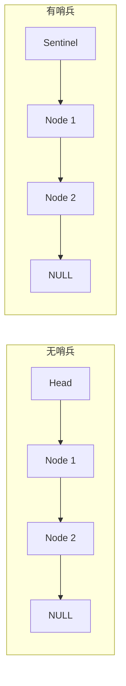
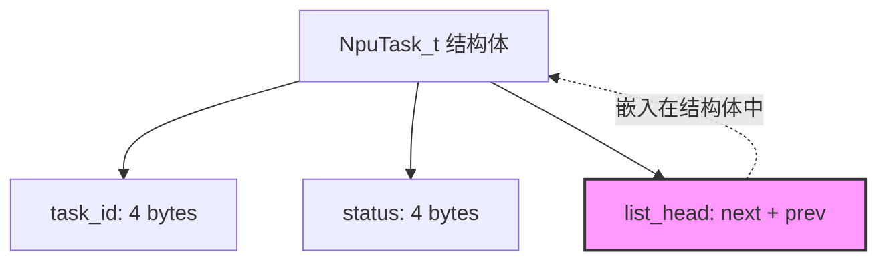

# 第 6 章 - 嵌入式常用数据结构
<link rel="stylesheet" href="../assets/print-b5.css">

## 📝 本章总结
本章讲解嵌入式开发中最核心的数据结构：单向链表、双向链表（侵入式设计）、环形缓冲区 (Ring Buffer) 以及简单哈希表。重点在于如何在没有 `malloc` 的裸机/内核环境中高效、安全地管理数据队列。

---

## 📖 本章内容
1. 为什么嵌入式不依赖 STL / 动态集合
2. 单向链表 (Singly Linked List)
3. 双向链表与 Linux `list.h` 侵入式设计
4. 环形缓冲区 (Ring Buffer) —— NPU 数据流的核心
5. 简单哈希表 (Hash Table) 与键值查找
6. 内存池 + 数据结构组合：无 malloc 的动态数据管理

---

## 1. 为什么嵌入式不依赖 STL / 动态集合

在标准 C++ 或高级语言中，我们可以直接使用 `std::vector`、`std::list` 或 Python 的 `dict`。但在嵌入式 Linux / 裸机 NPU 开发中，这些容器通常不可用或不适用：

| 限制 | 说明 | 嵌入式解决方案 |
|------|------|----------------|
| **内存碎片** | `new` / `malloc` 频繁分配会导致碎片化 | 使用静态数组 + 内存池 |
| **不可预测的延迟** | `std::vector` 扩容时会重新分配并拷贝 | 预分配固定容量 (Static Array) |
| **代码体积** | C++ STL 会显著增加二进制体积 (Flash 受限) | 手写精简版 C 数据结构 |
| **内核态限制** | Linux 内核无法使用用户态 malloc | 使用 `kmalloc` / 静态分配 / 侵入式链表 |

**核心设计原则**：**预分配、固定容量、无隐式动态内存分配**。

---

## 2. 单向链表 (Singly Linked List)

单向链表是最基础的数据结构，适用于只需要单向遍历的场景（如任务队列、日志缓冲区）。

### 2.1 基础实现

```c
typedef struct Node {
    int data;              // 有效载荷
    struct Node *next;     // 指向下一个节点
} Node_t;

// 链表头
typedef struct {
    Node_t *head;
    int count;
} LinkedList_t;
```

### 2.2 核心操作

```c
// 头插法 (O(1))
void list_push_front(LinkedList_t *list, Node_t *node) {
    node->next = list->head;
    list->head = node;
    list->count++;
}

// 删除指定节点 (O(N))
void list_remove(LinkedList_t *list, Node_t *target) {
    Node_t *curr = list->head;
    Node_t *prev = NULL;
    
    while (curr) {
        if (curr == target) {
            if (prev) prev->next = curr->next;
            else list->head = curr->next;
            list->count--;
            curr->next = NULL; // 防止悬空指针
            return;
        }
        prev = curr;
        curr = curr->next;
    }
}
```

### 2.3 哨兵节点 (Sentinel Node)

在链表头部添加一个虚拟的哨兵节点，可以消除 `if (head == NULL)` 的特殊判断，简化代码逻辑。



---

## 3. 双向链表与 Linux `list.h` 侵入式设计

Linux 内核使用了一种极其优雅的**侵入式链表 (Intrusive Linked List)** 设计。节点不包含数据，而是嵌入在数据结构内部。

### 3.1 Linux `list_head` 结构

```c
// Linux 内核链表定义
struct list_head {
    struct list_head *next, *prev;
};
```

### 3.2 侵入式链表的优势

```c
typedef struct {
    int task_id;
    int status;
    struct list_head list;  // ← 链表节点嵌入在业务结构中
} NpuTask_t;

// ✅ 优势 1：一个结构体可以同时属于多个链表
typedef struct {
    int task_id;
    struct list_head ready_list;   // 就绪队列
    struct list_head running_list; // 运行队列
} MultiListTask_t;

// ✅ 优势 2：通过 list_entry 宏获取宿主结构体
#define list_entry(ptr, type, member) \
    container_of(ptr, type, member)

// 使用示例
struct list_head *pos;
list_for_each(pos, &task_list) {
    NpuTask_t *task = list_entry(pos, NpuTask_t, list);
    printf("Task ID: %d\n", task->task_id);
}
```

**侵入式链表内存布局：**


### 3.3 为什么侵入式链表更好？
- **无额外分配**：节点就是数据结构本身，不需要单独 `malloc` 链表节点。
- **缓存友好**：遍历链表时直接访问业务数据，减少 Cache Miss。
- **类型安全**：通过 `container_of` 宏，编译器可以检查类型匹配。

---

## 4. 环形缓冲区 (Ring Buffer) —— NPU 数据流的核心

**Ring Buffer** 是嵌入式开发中最重要的数据结构之一。它用固定大小的数组模拟队列，非常适合 **生产者-消费者模型**（如 NPU 推理结果队列、串口数据缓冲、DMA 传输缓冲区）。

### 4.1 核心原理

```mermaid
graph TD
    subgraph 环形缓冲区 (容量=8)
        A[0] --- B[1] --- C[2] --- D[3]
        D --- E[4] --- F[5] --- G[6] --- H[7]
        H --- A
    end
    
    Prod[Producer: write_index=3] --> D
    Cons[Consumer: read_index=1] --> B
    
    style Prod fill:#fbb,stroke:#333
    style Cons fill:#bbf,stroke:#333
```

### 4.2 基础实现 (无锁单生产者/单消费者)

```c
#define RING_BUF_SIZE 1024

typedef struct {
    uint8_t buffer[RING_BUF_SIZE];
    volatile uint32_t read_idx;  // volatile 防止编译器优化
    volatile uint32_t write_idx;
} RingBuffer_t;

// 初始化
void ring_init(RingBuffer_t *rb) {
    rb->read_idx = 0;
    rb->write_idx = 0;
}

// 写入一个字节 (生产者)
int ring_push(RingBuffer_t *rb, uint8_t byte) {
    uint32_t next_write = (rb->write_idx + 1) % RING_BUF_SIZE;
    if (next_write == rb->read_idx) {
        return -1; // 缓冲区满
    }
    rb->buffer[rb->write_idx] = byte;
    rb->write_idx = next_write;
    return 0;
}

// 读取一个字节 (消费者)
int ring_pop(RingBuffer_t *rb, uint8_t *byte) {
    if (rb->read_idx == rb->write_idx) {
        return -1; // 缓冲区空
    }
    *byte = rb->buffer[rb->read_idx];
    rb->read_idx = (rb->read_idx + 1) % RING_BUF_SIZE;
    return 0;
}
```

### 4.3 性能优化：使用 2 的幂次容量

取模运算 `%` 在 CPU 上较慢（除法指令）。当容量为 2 的幂时，可以用位运算 `&` 替代：

```c
#define RING_SIZE_MASK (RING_BUF_SIZE - 1) // 假设 SIZE=1024, MASK=0x3FF

// 优化后的索引计算
uint32_t next_write = (rb->write_idx + 1) & RING_SIZE_MASK;

// 编译器优化提示
// 现代 GCC/Clang 在编译期常量取模时会自动优化为位运算，
// 但显式写 & 更直观且保证跨编译器一致。
```

### 4.4 NPU 场景：多帧推理结果队列

```c
typedef struct {
    uint32_t frame_id;
    float confidence;
    int class_id;
} InferenceResult_t;

#define RESULT_QUEUE_SIZE 16 // 2 的幂

typedef struct {
    InferenceResult_t results[RESULT_QUEUE_SIZE];
    volatile uint32_t head;
    volatile uint32_t tail;
} ResultQueue_t;

// 入队 (NPU 中断处理函数中调用)
void result_enqueue(ResultQueue_t *q, InferenceResult_t *res) {
    uint32_t next = (q->tail + 1) & (RESULT_QUEUE_SIZE - 1);
    if (next != q->head) {
        q->results[q->tail] = *res;
        q->tail = next;
    } else {
        log_error("Result queue full! Dropping frame.");
    }
}
```

---

## 5. 简单哈希表 (Hash Table) 与键值查找

在嵌入式中，完整的哈希表实现过于复杂。通常使用 **开放寻址法 (Open Addressing)** 配合线性探测即可满足需求。

### 5.1 基础哈希表

```c
#define HASH_TABLE_SIZE 64
#define HASH_EMPTY 0xFFFFFFFF

typedef struct {
    uint32_t key;
    uint32_t value;
} HashEntry_t;

static HashEntry_t hash_table[HASH_TABLE_SIZE];

// 简单哈希函数 (FNV-1a)
static uint32_t hash_func(uint32_t key) {
    uint32_t hash = 2166136261U;
    hash ^= key;
    hash *= 16777619U;
    return hash % HASH_TABLE_SIZE;
}

// 插入
void hash_set(uint32_t key, uint32_t value) {
    uint32_t idx = hash_func(key);
    
    // 线性探测解决冲突
    for (int i = 0; i < HASH_TABLE_SIZE; i++) {
        uint32_t pos = (idx + i) % HASH_TABLE_SIZE;
        if (hash_table[pos].key == HASH_EMPTY || hash_table[pos].key == key) {
            hash_table[pos].key = key;
            hash_table[pos].value = value;
            return;
        }
    }
    log_error("Hash table full!");
}

// 查询
uint32_t hash_get(uint32_t key, uint32_t default_val) {
    uint32_t idx = hash_func(key);
    for (int i = 0; i < HASH_TABLE_SIZE; i++) {
        uint32_t pos = (idx + i) % HASH_TABLE_SIZE;
        if (hash_table[pos].key == key) {
            return hash_table[pos].value;
        }
        if (hash_table[pos].key == HASH_EMPTY) break; // 没找到
    }
    return default_val;
}
```

---

## 6. 内存池 + 数据结构组合：无 malloc 的动态数据管理

在嵌入式内核或实时系统中，绝对不能使用 `malloc`。我们通过 **静态内存池** 来模拟动态分配。

### 6.1 固定块内存池 (Fixed-Block Memory Pool)

```c
#define POOL_BLOCK_SIZE 128
#define POOL_BLOCK_COUNT 32

typedef struct {
    uint8_t memory[POOL_BLOCK_COUNT * POOL_BLOCK_SIZE];
    uint8_t used[POOL_BLOCK_COUNT]; // 0=空闲, 1=已分配
} MemPool_t;

void *pool_alloc(MemPool_t *pool) {
    for (int i = 0; i < POOL_BLOCK_COUNT; i++) {
        if (!pool->used[i]) {
            pool->used[i] = 1;
            return &pool->memory[i * POOL_BLOCK_SIZE];
        }
    }
    return NULL; // 池满
}

void pool_free(MemPool_t *pool, void *ptr) {
    uint8_t *p = (uint8_t *)ptr;
    if (p >= pool->memory && p < pool->memory + sizeof(pool->memory)) {
        int idx = (p - pool->memory) / POOL_BLOCK_SIZE;
        pool->used[idx] = 0;
    }
}
```

### 6.2 链表 + 内存池实战

```c
// 预分配节点池
static MemPool_t node_pool;
static LinkedList_t active_list;

NpuTask_t *create_task(int id) {
    NpuTask_t *task = (NpuTask_t *)pool_alloc(&node_pool);
    if (!task) return NULL;
    
    task->task_id = id;
    task->status = TASK_PENDING;
    list_push_front(&active_list, (Node_t *)task);
    return task;
}

void destroy_task(NpuTask_t *task) {
    list_remove(&active_list, (Node_t *)task);
    pool_free(&node_pool, task);
}
```

---

## 排错：常见数据结构陷阱

| 现象 | 原因 | 解决方案 |
|------|------|----------|
| 链表遍历时死循环 | 节点 `next` 指针未初始化或形成环 | 始终初始化为 `NULL`，插入前检查 |
| Ring Buffer 假满 | 读写索引未正确处理边界条件 | 预留 1 个空位区分满/空状态 |
| 哈希表查询失败 | 哈希冲突未正确处理 | 使用线性探测或链地址法，检查 `== key` 比较 |
| 内存池碎片 | 释放后未正确标记 `used` | 增加校验逻辑，打印池状态调试 |

---

## 🔧 实操练习

1. **实现侵入式双向链表**: 定义 `list_head` 结构，实现 `list_add`、`list_del`、`list_for_each` 宏，并编写测试代码验证节点增删。
2. **Ring Buffer 压力测试**: 创建生产者线程不断写入，消费者线程不断读取，运行 10 万次操作，验证无数据丢失、无越界。
3. **内存池实现**: 编写一个支持任意大小分配的内存池（使用链表管理空闲块），对比 `malloc` 的性能和内存碎片率。

---

**最后更新**: 2026-04-22
**维护者**: 苏亚雷斯 (Suarez)