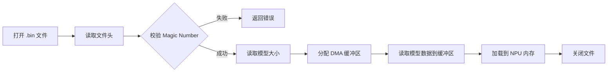

# 第 8 章 - 文件 I/O 与序列化
<link rel="stylesheet" href="../assets/print-b5.css">

## 📝 本章总结
本章讲解 C 语言中的文件操作：标准 I/O (`fopen`/`fread`) 与系统调用 (`open`/`read`) 的区别、二进制数据的序列化与反序列化、JSON/XML 的轻量替代方案，以及 NPU 场景下的模型文件加载与推理结果持久化。

---

## 📖 本章内容
1. 标准 I/O vs 系统调用：缓冲区的差异
2. 文件描述符 (fd) 的本质
3. 二进制文件读写与结构体序列化
4. 嵌入式轻量配置解析 (替代 JSON/XML)
5. NPU 场景：加载 `.bin` 模型文件与保存推理结果
6. 排错：文件权限、`fseek` 偏移错误、缓冲 I/O 数据丢失

---

## 1. 标准 I/O vs 系统调用：缓冲区的差异

C 语言提供了两套文件操作 API，它们在嵌入式开发中有明确的适用场景。

### 1.1 API 对比

| 特性 | 标准 I/O (`<stdio.h>`) | 系统调用 (`<unistd.h>`) |
|------|------------------------|-------------------------|
| 函数族 | `fopen`, `fread`, `fwrite`, `fclose` | `open`, `read`, `write`, `close` |
| 返回值 | `FILE*` 指针 | 文件描述符 `int fd` |
| 缓冲机制 | **带用户态缓冲区** (默认 4KB) | **无缓冲**，直接陷入内核 |
| 性能 | 适合频繁小数据读写 (减少系统调用) | 适合大块数据 / 直接控制 I/O |
| 适用场景 | 日志记录、配置文件解析 | 设备文件 (`/dev/npu`)、DMA 传输 |

### 1.2 内存布局示意


### 1.3 何时使用哪一套？

```c
// ✅ 场景 A：读取配置文件 (小数据、频繁读取)
FILE *fp = fopen("/etc/npu_config.ini", "r");
char line[256];
while (fgets(line, sizeof(line), fp)) {
    parse_config_line(line); // 逐行解析
}
fclose(fp);

// ✅ 场景 B：读取 NPU 模型文件 (大块二进制数据)
int fd = open("/data/model.rknn", O_RDONLY);
size_t file_size = lseek(fd, 0, SEEK_END);
lseek(fd, 0, SEEK_SET);

void *model_buf = malloc(file_size);
read(fd, model_buf, file_size); // 一次性读取，无中间缓冲
close(fd);

// ✅ 场景 C：与设备文件通信 (必须用系统调用)
int npu_fd = open("/dev/npu", O_RDWR);
write(npu_fd, cmd_buf, cmd_len); // stdio 无法操作设备文件
close(npu_fd);
```

---

## 2. 文件描述符 (fd) 的本质

文件描述符是一个非负整数，它是内核用来标识进程的打开文件表的索引。

### 2.1 标准 fd 分配

| fd | 名称 | 默认设备 | 说明 |
|----|------|----------|------|
| 0 | `STDIN_FILENO` | 键盘/串口 | 标准输入 |
| 1 | `STDOUT_FILENO` | 屏幕/串口 | 标准输出 |
| 2 | `STDERR_FILENO` | 屏幕/串口 | 标准错误 |
| 3+ | - | 打开的文件/设备/Socket | 按打开顺序递增分配 |

### 2.2 fd 泄漏：嵌入式系统的隐形杀手

```c
void log_to_file(const char *msg) {
    int fd = open("/var/log/npu.log", O_WRONLY | O_CREAT | O_APPEND, 0644);
    write(fd, msg, strlen(msg));
    // ❌ 忘记 close(fd)！
}

// 每次调用泄漏 1 个 fd。Linux 默认限制 1024 个 fd。
// 1024 次调用后，open() 将返回 -1 (EMFILE)，系统功能瘫痪。
```

**修复方案：**
```c
// ✅ 始终配对 open/close
void log_to_file_fixed(const char *msg) {
    int fd = open("/var/log/npu.log", O_WRONLY | O_CREAT | O_APPEND, 0644);
    if (fd < 0) return;
    write(fd, msg, strlen(msg));
    close(fd); // 立即释放
}
```

---

## 3. 二进制文件读写与结构体序列化

在嵌入式系统中，直接读写结构体二进制数据比文本格式更高效、更节省空间。

### 3.1 写入结构体到文件

```c
typedef struct __attribute__((packed)) {
    uint32_t frame_id;
    uint32_t timestamp;
    float confidence;
    int16_t class_id;
    int16_t x, y, w, h;
} DetectionRecord_t;

int save_detections(const char *filename, DetectionRecord_t *records, int count) {
    FILE *fp = fopen(filename, "wb");
    if (!fp) return -1;
    
    // 写入记录数量
    fwrite(&count, sizeof(count), 1, fp);
    
    // 写入所有记录
    size_t written = fwrite(records, sizeof(DetectionRecord_t), count, fp);
    fclose(fp);
    
    return (written == count) ? 0 : -1;
}
```

### 3.2 从文件读取结构体

```c
int load_detections(const char *filename, DetectionRecord_t **out_records, int *out_count) {
    FILE *fp = fopen(filename, "rb");
    if (!fp) return -1;
    
    // 读取记录数量
    int count;
    if (fread(&count, sizeof(count), 1, fp) != 1) {
        fclose(fp);
        return -1;
    }
    
    // 分配内存并读取
    *out_records = malloc(count * sizeof(DetectionRecord_t));
    if (!*out_records) {
        fclose(fp);
        return -1;
    }
    
    size_t read_count = fread(*out_records, sizeof(DetectionRecord_t), count, fp);
    fclose(fp);
    
    *out_count = (read_count == count) ? count : -1;
    return 0;
}
```

### 3.3 字节序 (Endianness) 陷阱

如果二进制文件需要在不同架构的设备间传输（如 ARM NPU ↔ x86 PC），必须处理字节序问题。

```c
// 小端序 (LE) 转主机字节序
static inline uint32_t le32_to_cpu(uint32_t val) {
#if __BYTE_ORDER__ == __ORDER_LITTLE_ENDIAN__
    return val; // 本机就是小端，直接返回
#else
    return __builtin_bswap32(val); // 大端机需要字节交换
#endif
}

// 写入时统一转换为小端序
static inline uint32_t cpu_to_le32(uint32_t val) {
    return le32_to_cpu(val); // 转换逻辑相同
}
```

**建议**：嵌入式项目统一约定使用 **小端序 (Little-Endian)** 存储二进制文件，并在文件头添加 Magic Number 标识。

---

## 4. 嵌入式轻量配置解析 (替代 JSON/XML)

JSON 和 XML 解析库体积庞大（通常 50KB+ Flash），在资源受限的 NPU 板子上，推荐使用 **INI 格式** 或 **键值对文本**。

### 4.1 极简 INI 解析器

```c
// config.ini 格式:
// [npu]
// clock=800
// voltage=1.1
// debug=1

typedef struct {
    char key[32];
    char value[64];
} ConfigEntry_t;

int parse_ini(const char *filename, ConfigEntry_t *entries, int max_entries) {
    FILE *fp = fopen(filename, "r");
    if (!fp) return -1;
    
    char line[256];
    int count = 0;
    char current_section[32] = {0};
    
    while (fgets(line, sizeof(line), fp) && count < max_entries) {
        // 跳过注释和空行
        if (line[0] == '#' || line[0] == '\n') continue;
        
        // 解析节 [section]
        if (line[0] == '[') {
            sscanf(line, "[%31[^]]]", current_section);
            continue;
        }
        
        // 解析 key=value
        char *eq = strchr(line, '=');
        if (eq) {
            *eq = '\0';
            // 拼接 section.key 作为完整键名
            snprintf(entries[count].key, sizeof(entries[count].key), 
                     "%s.%s", current_section, line);
            // 去除值末尾的换行符
            eq++;
            size_t len = strlen(eq);
            if (len > 0 && eq[len-1] == '\n') eq[len-1] = '\0';
            strncpy(entries[count].value, eq, sizeof(entries[count].value)-1);
            count++;
        }
    }
    
    fclose(fp);
    return count;
}

// 使用
ConfigEntry_t configs[32];
int n = parse_ini("config.ini", configs, 32);
for (int i = 0; i < n; i++) {
    printf("%s = %s\n", configs[i].key, configs[i].value);
}
```

---

## 5. NPU 场景：加载 `.bin` 模型文件与保存推理结果

### 5.1 加载 NPU 模型文件

NPU 模型通常是一个包含权重和拓扑结构的二进制文件。加载流程如下：



```c
#define NPU_MODEL_MAGIC 0x4E50554D // "NPUM"

typedef struct __attribute__((packed)) {
    uint32_t magic;
    uint32_t version;
    uint32_t model_size;
    uint32_t input_width;
    uint32_t input_height;
    uint32_t input_channels;
} ModelHeader_t;

int load_npu_model(const char *path, void **model_buf, ModelHeader_t *header) {
    int fd = open(path, O_RDONLY);
    if (fd < 0) {
        log_error("Failed to open model file: %s", path);
        return -1;
    }
    
    // 读取头部
    if (read(fd, header, sizeof(ModelHeader_t)) != sizeof(ModelHeader_t)) {
        close(fd);
        return -1;
    }
    
    // 校验 Magic Number
    if (header->magic != NPU_MODEL_MAGIC) {
        log_error("Invalid model format!");
        close(fd);
        return -1;
    }
    
    // 分配内存 (使用 DMA 兼容对齐)
    *model_buf = aligned_alloc(4096, header->model_size);
    if (!*model_buf) {
        close(fd);
        return -1;
    }
    
    // 读取模型数据
    ssize_t bytes_read = read(fd, *model_buf, header->model_size);
    close(fd);
    
    if (bytes_read != header->model_size) {
        free(*model_buf);
        return -1;
    }
    
    log_info("Model loaded: %dx%dx%d, size=%u bytes", 
             header->input_width, header->input_height, 
             header->input_channels, header->model_size);
    return 0;
}
```

### 5.2 保存推理结果 (CSV 格式)

虽然二进制高效，但推理结果通常需要给人看，CSV 是最佳选择：

```c
int save_results_csv(const char *filename, DetectionRecord_t *results, int count) {
    FILE *fp = fopen(filename, "w");
    if (!fp) return -1;
    
    // 写入 CSV 头部
    fprintf(fp, "frame_id,timestamp,confidence,class_id,x,y,w,h\n");
    
    for (int i = 0; i < count; i++) {
        fprintf(fp, "%u,%u,%.4f,%d,%d,%d,%d,%d\n",
                results[i].frame_id,
                results[i].timestamp,
                results[i].confidence,
                results[i].class_id,
                results[i].x, results[i].y,
                results[i].w, results[i].h);
    }
    
    fclose(fp);
    return 0;
}
```

---

## 6. 排错：常见文件 I/O 陷阱

| 现象 | 原因 | 解决方案 |
|------|------|----------|
| 写入文件后内容为空 | 未调用 `fclose` 或 `fflush`，数据还在缓冲区 | 写入后立即 `fflush(fp)` 或使用 `O_SYNC` 标志 |
| `fseek` 偏移错误 | 在文本模式 (`"r"`) 下使用 `fseek` 可能受换行符转换影响 | 始终使用二进制模式 (`"rb"`, `"wb"`) |
| 权限拒绝 (`EACCES`) | 文件权限不足或 SELinux/AppArmor 拦截 | 检查 `ls -l` 权限，或使用 `chmod` 修改 |
| 结构体读取数据错乱 | 写入和读取端字节序不同，或 `packed` 属性不一致 | 统一使用 `__attribute__((packed))`，显式处理字节序 |
| `read` 返回部分数据 | 网络/管道文件可能不会一次性返回全部数据 | 循环读取直到达到预期字节数 |

---

## 🔧 实操练习

1. **实现循环日志文件**: 编写一个日志模块，支持最多 3 个日志文件轮转 (`npu.log`, `npu.log.1`, `npu.log.2`)，每个文件最大 1MB，超过时自动轮转。
2. **二进制配置文件读写**: 定义一个包含 10 个配置项的结构体，将其序列化到 `.bin` 文件，再反序列化回内存，验证数据一致性。
3. **简易 INI 解析器**: 扩展第 4 节的 INI 解析器，支持整数、浮点数、字符串类型的自动转换，并添加错误处理（如键不存在时返回默认值）。

---

**最后更新**: 2026-04-22
**维护者**: 苏亚雷斯 (Suarez)