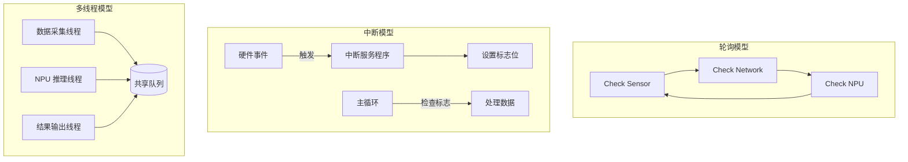
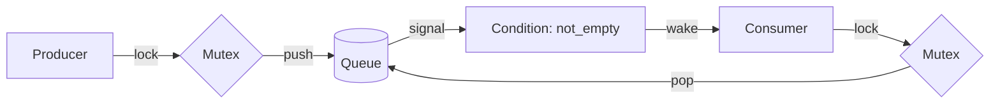

# 第 9 章 - 并发与多任务基础
<link rel="stylesheet" href="../assets/print-b5.css">

## 📝 本章总结
本章讲解嵌入式系统中的并发模型：轮询 vs 中断 vs 多线程，信号量与互斥锁的实现，生产者-消费者模式，状态机设计（查表法 vs switch-case），以及协程/微线程的零栈开销模式。重点解决 NPU 多任务调度中的竞态条件与死锁问题。

---

## 📖 本章内容
1. 嵌入式并发模型：轮询、中断、多线程
2. 信号量 (Semaphore) 与互斥锁 (Mutex) 的 C 语言实现
3. 生产者-消费者问题的 C 语言解法
4. 状态机 (State Machine) 设计模式
5. 协程/微线程简介 (protothread 模式)
6. 排错：竞态条件、死锁、重入问题

---

## 1. 嵌入式并发模型：轮询、中断、多线程

在 NPU 开发中，我们通常需要同时处理：数据接收、模型推理、结果输出、状态监控。如何组织这些并发任务？

### 1.1 三种模型对比

| 模型 | 原理 | 优点 | 缺点 | 适用场景 |
|------|------|------|------|----------|
| **轮询 (Polling)** | 循环检查各任务状态 | 简单、无同步开销 | CPU 占用高、响应延迟大 | 极简单任务、Bootloader |
| **中断 (Interrupt)** | 硬件事件触发回调 | 响应极快、CPU 利用率高 | 上下文复杂、不可重入 | 串口接收、DMA 完成、定时器 |
| **多线程 (Thread)** | OS 调度多个执行流 | 结构清晰、易于扩展 | 栈空间开销大、同步复杂 | Linux 用户态应用、推理服务 |



### 1.2 混合模型：实际项目中的最佳实践

```c
// 典型 NPU 应用架构
int main(void) {
    npu_init();
    ring_buffer_init(&data_queue);
    
    // 线程 1：采集传感器数据 (生产者)
    pthread_create(&采集线程, NULL, sensor_thread, NULL);
    
    // 线程 2：NPU 推理 (消费者)
    pthread_create(&推理线程, NULL, inference_thread, NULL);
    
    // 主线程：监控与日志
    while (1) {
        print_system_status();
        sleep(1);
    }
}
```

---

## 2. 信号量 (Semaphore) 与互斥锁 (Mutex) 的 C 语言实现

### 2.1 互斥锁 (Mutex)：保护共享资源

```c
#include <pthread.h>

pthread_mutex_t data_lock = PTHREAD_MUTEX_INITIALIZER;
NpuConfig_t shared_config;

void update_config(NpuConfig_t *new_cfg) {
    pthread_mutex_lock(&data_lock);      // 🔒 加锁
    shared_config = *new_cfg;            // 临界区
    pthread_mutex_unlock(&data_lock);    // 🔓 解锁
}

void read_config(NpuConfig_t *out_cfg) {
    pthread_mutex_lock(&data_lock);
    *out_cfg = shared_config;
    pthread_mutex_unlock(&data_lock);
}
```

**Mutex 使用铁律：**
1. 临界区越短越好（不要在锁内执行 `printf`、`sleep`、网络 I/O）。
2. 必须保证 `lock` 和 `unlock` 成对出现（使用 `goto cleanup` 处理异常路径）。
3. 避免嵌套锁（A 锁里申请 B 锁 → 死锁风险）。

### 2.2 信号量 (Semaphore)：任务同步

```c
#include <semaphore.h>

// 初始化信号量，初始值为 0 (阻塞状态)
sem_t npu_ready_sem;
sem_init(&npu_ready_sem, 0, 0);

// NPU 中断处理函数 (生产者)
void npu_irq_handler(void) {
    // 硬件处理完成...
    sem_post(&npu_ready_sem); // 信号量 +1，唤醒等待线程
}

// 用户态推理线程 (消费者)
void inference_thread(void *arg) {
    while (1) {
        sem_wait(&npu_ready_sem); // 阻塞，直到信号量 >0
        process_inference_result();
    }
}
```

**Mutex vs Semaphore 核心区别：**
- **Mutex** 是**锁**，用于互斥（同一时间只有一个线程能访问）。
- **Semaphore** 是**计数器**，用于同步（等待某个事件发生）。

---

## 3. 生产者-消费者问题的 C 语言解法

这是 NPU 数据流中最经典的并发模式。

### 3.1 基于 Mutex + Condition Variable 的实现

```c
#define QUEUE_SIZE 16

typedef struct {
    InferenceTask_t tasks[QUEUE_SIZE];
    int head, tail, count;
    pthread_mutex_t lock;
    pthread_cond_t not_full;   // 队列不满的条件
    pthread_cond_t not_empty;  // 队列不空的条件
} TaskQueue_t;

void queue_init(TaskQueue_t *q) {
    q->head = q->tail = q->count = 0;
    pthread_mutex_init(&q->lock, NULL);
    pthread_cond_init(&q->not_full, NULL);
    pthread_cond_init(&q->not_empty, NULL);
}

// 入队 (生产者)
void queue_push(TaskQueue_t *q, InferenceTask_t *task) {
    pthread_mutex_lock(&q->lock);
    
    while (q->count == QUEUE_SIZE) {
        pthread_cond_wait(&q->not_full, &q->lock); // 阻塞直到队列不满
    }
    
    q->tasks[q->tail] = *task;
    q->tail = (q->tail + 1) % QUEUE_SIZE;
    q->count++;
    
    pthread_cond_signal(&q->not_empty); // 唤醒消费者
    pthread_mutex_unlock(&q->lock);
}

// 出队 (消费者)
void queue_pop(TaskQueue_t *q, InferenceTask_t *task) {
    pthread_mutex_lock(&q->lock);
    
    while (q->count == 0) {
        pthread_cond_wait(&q->not_empty, &q->lock); // 阻塞直到队列不空
    }
    
    *task = q->tasks[q->head];
    q->head = (q->head + 1) % QUEUE_SIZE;
    q->count--;
    
    pthread_cond_signal(&q->not_full); // 唤醒生产者
    pthread_mutex_unlock(&q->lock);
}
```

**工作流程示意：**


---

## 4. 状态机 (State Machine) 设计模式

NPU 推理任务有明确的状态流转：`IDLE → LOADING → RUNNING → DONE / ERROR`。使用状态机可以让代码逻辑清晰、易于调试。

### 4.1 Switch-Case 状态机

```c
typedef enum {
    STATE_IDLE,
    STATE_LOADING,
    STATE_RUNNING,
    STATE_DONE,
    STATE_ERROR
} NpuState_t;

NpuState_t current_state = STATE_IDLE;

void npu_state_machine(void) {
    switch (current_state) {
        case STATE_IDLE:
            if (has_pending_task()) {
                load_model();
                current_state = STATE_LOADING;
            }
            break;
            
        case STATE_LOADING:
            if (is_model_loaded()) {
                start_inference();
                current_state = STATE_RUNNING;
            }
            break;
            
        case STATE_RUNNING:
            if (is_inference_done()) {
                collect_results();
                current_state = STATE_DONE;
            } else if (is_error_detected()) {
                current_state = STATE_ERROR;
            }
            break;
            
        case STATE_DONE:
            save_results();
            cleanup();
            current_state = STATE_IDLE;
            break;
            
        case STATE_ERROR:
            log_error("NPU task failed!");
            reset_hardware();
            current_state = STATE_IDLE;
            break;
    }
}
```

### 4.2 查表法状态机 (更优雅、易扩展)

当状态和事件较多时，查表法比 `switch-case` 更易维护：

```c
// 事件定义
typedef enum {
    EVT_TASK_ARRIVE,
    EVT_MODEL_LOADED,
    EVT_INFERENCE_DONE,
    EVT_ERROR,
    EVT_MAX
} NpuEvent_t;

// 状态转换函数类型
typedef NpuState_t (*StateFunc_t)(void);

// 状态转换表 [当前状态][事件] → 处理函数
static const StateFunc_t state_table[STATE_ERROR + 1][EVT_MAX] = {
    // EVT_TASK_ARRIVE      EVT_MODEL_LOADED       EVT_INFERENCE_DONE     EVT_ERROR
    { handle_idle_task,    NULL,                   NULL,                  NULL },          // IDLE
    { NULL,                handle_loading_done,    NULL,                  handle_error },   // LOADING
    { NULL,                NULL,                   handle_running_done,   handle_error },   // RUNNING
    { NULL,                NULL,                   NULL,                  NULL },           // DONE
    { NULL,                NULL,                   NULL,                  handle_error_reset }, // ERROR
};

void npu_handle_event(NpuEvent_t evt) {
    StateFunc_t func = state_table[current_state][evt];
    if (func) {
        current_state = func(); // 执行状态转换
    }
}
```

**查表法优势：**
- 新增状态/事件只需扩展表格，无需修改核心逻辑。
- 空指针 (`NULL`) 天然表示“该状态下不响应此事件”。
- 易于添加日志/监控（在 `npu_handle_event` 中统一打印）。

---

## 5. 协程/微线程简介 (protothread 模式)

在资源极度受限的 MCU 或内核模块中，无法承受线程的栈开销（通常 8KB+）。**Protothread** 是一种零栈开销的轻量级并发模型。

### 5.1 Protothread 核心原理

利用 C 语言的 `switch-case` 穿透特性，保存执行位置，下次调用时直接跳转到上次暂停的位置。

```c
#include "pt.h" // Adam Dunkels 的 protothread 库

static int sensor_thread(struct pt *pt) {
    static int reading; // 必须 static！保存状态
    
    PT_BEGIN(pt);
    
    while (1) {
        reading = read_sensor();
        PT_WAIT_UNTIL(pt, reading > THRESHOLD); // 暂停，直到条件满足
        
        send_alert(reading);
        PT_WAIT_UNTIL(pt, sensor_ready());      // 再次暂停
    }
    
    PT_END(pt);
}
```

**内存对比：**
| 模型 | 每个任务内存开销 | 上下文切换开销 |
|------|------------------|----------------|
| `pthread` | 8KB (栈) + 内核结构 | ~1-5 μs |
| Protothread | 20 bytes (struct pt) | ~0.1 μs |

**适用场景**：简单的状态轮询、协议解析、低功耗传感器采集。**不适用**于需要复杂阻塞调用或大量局部变量的场景。

---

## 6. 排错：竞态条件、死锁、重入问题

| 现象 | 原因 | 解决方案 |
|------|------|----------|
| **竞态条件 (Race Condition)** | 多线程同时读写共享变量，结果不确定 | 使用 Mutex 保护临界区，或使用原子操作 (`stdatomic.h`) |
| **死锁 (Deadlock)** | 线程 A 持有锁 1 等待锁 2，线程 B 持有锁 2 等待锁 1 | 固定加锁顺序，使用 `pthread_mutex_trylock` 超时重试 |
| **活锁 (Livelock)** | 线程不断重试但永远无法推进 | 引入随机退避 (Random Backoff) 延迟 |
| **函数不可重入** | 中断中调用了使用静态缓冲区的函数 | 使用 `_r` 后缀版本 (`strtok_r`, `gmtime_r`) 或禁用中断 |
| **优先级反转** | 低优先级任务持有锁，阻塞高优先级任务 | 使用优先级继承 Mutex (`PTHREAD_PRIO_INHERIT`) |

---

## 🔧 实操练习

1. **实现线程安全的日志模块**: 多个线程同时调用 `log_info()`，使用 Mutex 保证日志行不交错，并实现环形日志缓冲区。
2. **生产者-消费者压测**: 创建 2 个生产者线程和 2 个消费者线程，通过任务队列传递 100 万个任务，验证无数据丢失、无死锁。
3. **NPU 状态机实现**: 使用查表法实现第 4 节的 NPU 状态机，模拟完整推理流程（IDLE → LOADING → RUNNING → DONE），并添加事件日志。

---

**最后更新**: 2026-04-22
**维护者**: 苏亚雷斯 (Suarez)